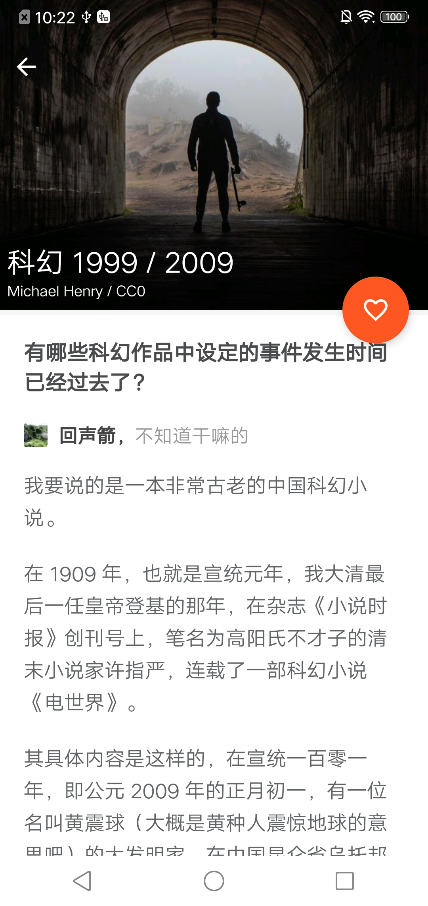
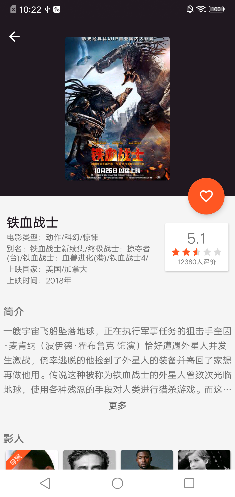

# Find

 

## 简介

新闻阅读类 App，模块化开发

## 截图

### 开源库：
- [**retrofit2**](https://github.com/square/retrofit)
- [**rxjava2**](https://github.com/ReactiveX/RxJava)
- [**glide**](https://github.com/bumptech/glide)
- [**ARouter**](https://github.com/alibaba/ARouter)
- [**gson**](https://github.com/google/gson)
- [**MultiType**](https://github.com/drakeet/MultiType)
- [**Toasty**](https://github.com/GrenderG/Toasty)
- [**SmartRefreshLayout**](https://github.com/scwang90/SmartRefreshLayout)
- [**ImmersionBar**](https://github.com/gyf-dev/ImmersionBar)

### 关于我

- [**Blog**](https://qihuan92.github.io/)
- **Email：** qihuan92@126.com

